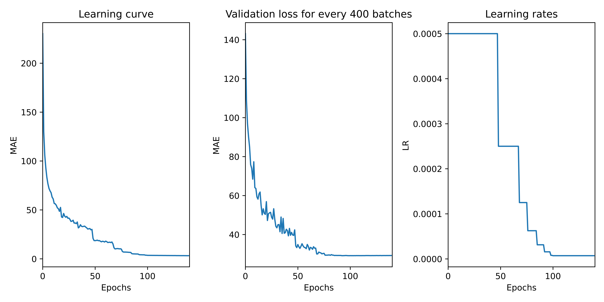

# PaiNN implementation with SWA and SWA-G

We propose the following simple implementation of the [PaiNN (Polarizable Neural Network) model](https://arxiv.org/abs/2102.03150), this implementation also allow you to use [Stochastic Weight Averaging (SWA)](https://arxiv.org/abs/1803.05407) or [Stochastic Weight Averaging-Gaussian (SWA-G)](https://arxiv.org/abs/1902.02476) to find a model that generalizes better than classic SGD resulting models.

## Prerequisites

This repository uses the following packages: numpy, torch, pytorch_geometric, matplotlib, math

## Train your proper model

This repository can be used to train your proper model as it takes the form of a pip package, you first need to clone the repository and then run the following command inside the `PaiNN` folder (there should be a `setup.py` file in that folder)

```
pip install .
```

Once this is done you can run your proper training run using the `main.py` where you can toggle various paremeters to define your training process

You can also run this training on a cluster, here would be an example of a job that can run on a cluster 

```
#!/bin/sh

### General LSF options
#BSUB -q gpuv100
#BSUB -J training_painn
#BSUB -gpu "num=1:mode=exclusive_process"
#BSUB -W 1:00
#BSUB -n 4
#BSUB -R "span[hosts=1]"
#BSUB -R "rusage[mem=4GB]"
#BSUB -oo job_out/gpu%J.out
#BSUB -eo job_out/gpu%J.err
### -- end of LSF options --

# Load environment variables
source env/bin/activate

# Run training
python3 -u Project_Deep_Learning/PaiNN/PaiNN/main.py
```

## Jupyter notebook 
We propose a Jupyter notebook that you can run on Colab to train a PaiNN model directly online, it only install the needed packages and run the main.py program, it can be useful to reproduce the results of this project nevertheless we advise to use a cluster to train the PaiNN model as it usually takes around 12h to perform 100 epochs on the QM9 dataset.

This is the kind of loss plot you could expect at the end of your training

